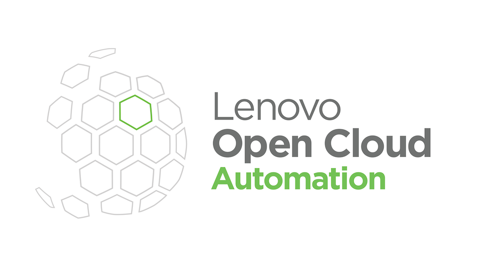

<!-- PROJECT LOGO -->
<br />
<p align="center">
  <a href="https://github.com/alexnastas/loca-bootstrap">
    
  </a>

  <h3 align="center">LOC-A Lightweight Bootstrap</h3>

  <p align="center">
    An attempt at creating a container-based bootstrap host for Lenovo OpenCloud Automation
    <br />
    <br />
    <a href="https://github.com/alexnastas/loca-bootstrap/issues">Report Bug</a>
    ·
    <a href="https://github.com/alexnastas/loca-bootstrap/issues">Request Feature</a>
  </p>
</p>


<!-- TABLE OF CONTENTS -->
## Table of Contents

* [About the Project](#about-the-project)
  * [Built With](#built-with)
* [Getting Started](#getting-started)
  * [Prerequisites](#prerequisites)
  * [Installation](#installation)
* [Roadmap](#roadmap)
* [Contributing](#contributing)
* [License](#license)
* [Contact](#contact)


<!-- ABOUT THE PROJECT -->
## About The Project

Today Lenovo Open Cloud Automation uses a heavy bootstrap process. All the bootstrap services (AWX, Gitlab, Netbox, etc.) are deployed in the form of Virtual Machines. Therefore it takes a long time and space. 
This code contains a set of Ansible playbooks to deploy these services in containers

### Built With

* [Ansible](https://www.ansible.com/)
* [Docker](https://www.docker.com/)
* [Docker-Compose](https://docs.docker.com/compose/)


<!-- GETTING STARTED -->
## Getting Started

To get a local copy up and running follow these simple steps

### Prerequisites

Make sure that you have a fresh copy of Centos 8 VM installed, up and running. 
The minimal VM requirements:
- 16GB RAM
- 4 vCPU
- 10GB HDD space

The VM should have Internet connectivity

### Installation

```sh
curl -L -k https://bit.ly/2GKq6qf | bash -s
```

<!-- ROADMAP -->
## Roadmap

See the [open issues](https://github.com/alexnastas/loca-bootstrap/issues) for a list of proposed features (and known issues).


<!-- CONTRIBUTING -->
## Contributing

Contributions are what make the open source community such an amazing place to learn, inspire, and create. Any contributions you make are **greatly appreciated**.

1. Fork the Project
2. Create your Feature Branch (`git checkout -b feature/AmazingFeature`)
3. Commit your Changes (`git commit -m 'Add some AmazingFeature'`)
4. Push to the Branch (`git push origin feature/AmazingFeature`)
5. Open a Pull Request


<!-- LICENSE -->
## License

Distributed under the MIT License. See [LICENSE](https://github.com/alexnastas/loca-bootstrap/blob/main/LICENSE) for more information.


<!-- CONTACT -->
## Contact

Alex Nastas - [@AlexNastas_t](https://twitter.com/AlexNastas_t) - alex.nastas@gmail.com

Project Link: [https://github.com/alexnastas/loca-bootstrap](https://github.com/alexnastas/loca-bootstrap)
